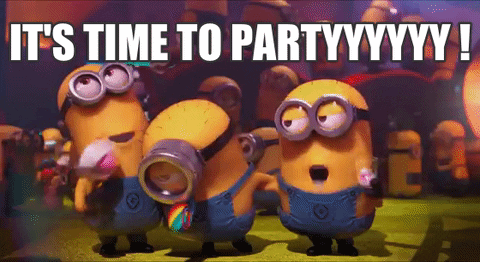
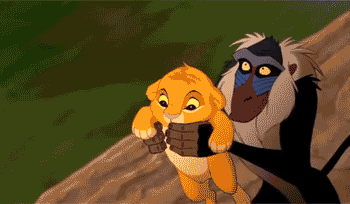

<!-- Banner with animated globe and title -->
<p align="center">
  
</p>

<h1 align="center">🌍 World Map Game 🎮</h1>

<p align="center">
  <b>Test your geography skills in a fun, interactive, and visually stunning map quiz game!</b>
</p>

<p align="center">
  
  
  
  
</p>

---

## ✨ Demo

<p align="center">
  
  <br/>
  
</p>

---

## 🕹️ Features

- 🌐 Interactive world map with clickable continents
- 🎯 Randomized geography questions
- 🏆 Animated results and celebratory effects (GIFs, fireworks, sounds)
- 🔊 Audio feedback for correct and wrong answers
- 📝 Customizable number of questions
- 🎨 Modern, responsive UI with Bootstrap and custom CSS
- 💾 High score tracking (local storage)
- 🎥 Video background for immersive experience

---

## 🚀 How to Play

1. **Enter your name** and select the number of questions.
2. **Start the game** and answer by clicking on the correct continent.
3. **Get instant feedback** with sounds and animations.
4. **View your results** and try to beat your high score!

<p align="center">
  
</p>

---

## 🛠️ Tech Stack

- HTML5, CSS3, JavaScript
- [Bootstrap 5](https://getbootstrap.com/)
- [tsparticles](https://github.com/tsparticles/tsparticles) for fireworks animation
- Custom images, GIFs, and audio assets

---

## 📦 Local Setup

1. **Clone the repository:**
   ```bash
   git clone https://github.com/your-username/WorldMapGame.git
   cd WorldMapGame
   ```
2. **Open `index.html` in your browser.**
   - No build or install steps required!

---

## 🙌 Credits

- Developed with ☕ by **Jayesh Kriplani**
- Map image, GIFs, and audio by project contributors
- Icons by [Icons8](https://icons8.com/)

---

## 📄 License

This project is for educational and personal use. Feel free to fork and enhance!

---

<p align="center">
  
  <br/>
  <b>Ready to challenge your world knowledge? <br/> Give it a ⭐ if you enjoy!</b>
</p>
****
